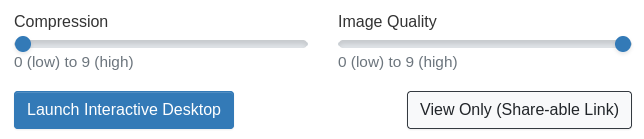

ACC - Advanced Computing Center : Web Portal
=====================================================

The [Exacloud Web Portal](https://exaweb.ohsu.edu/) provides a web-based interface for interacting with the Exacloud cluster. It is a user-friendly interface for file access, monitoring jobs, shell access, and launching certain types of interactive jobs. This portal is powered by the [Open OnDemand](https://openondemand.org/) software platform.

The web portal is only available on the internal OHSU network. That means in order to connect, you'll need to either be on-campus, or use on of the various remote access technologies like VPN, Citrix, or SSH tunneling.

To access the portal, navigate to the URL above, and then login with your OHSU username and password. You'll then be presented with a dashboard view, with several applications available via the navigation menu at the top of the page.

### Applications

Each component of the web portal is referred to as an application. These applications can be divided into two basic categories:

-   Convenience features, which are provided directly on the web portal server
-   Interactive jobs, which are run on compute nodes via the scheduler

See below for a description of the provided applications.

#### File Manager

The **File Manager** application provides a basic interface to navigate file systems, upload and download data, create directories and files, and perform deletions.

To open the file manager, navigate to the **Files** menu, and then select either the **Home Directory** or **gscratch** shortcuts. This will display a directory listing of the chosen location, and you are off from there. If you choose gscratch, you'll be in the top-level directory, so you'll need to choose your lab's sub-directory.

It is possible to change directory to other locations as well. Click the **Change directory** button in the path navigation area, and you can enter any location, for example RDS storage in `/home/groups`.

#### Job Scheduler

The web portal provides a means to monitor your cluster jobs, even those started outside of the portal. Under the **Jobs** menu navigate to **Active Jobs**. There you will see a summary of active jobs. You have the option of deleting jobs. You can also expand any individual job by pressing the **>** button in the left column, and see all the job details. You'll also see options to open the job's working directory in the File Manager or a Terminal session.

Also under the Jobs menu you'll find the **Job Composer** application. ACC does not presently support the job composer, but users are welcome to experiment with it.

#### Shell Access

You can open a shell session in the web portal by navigating to the **Clusters** menu and selecting **exacloud Shell Access**. This will open a terminal emulator in a new tab. Before the session starts you may be prompted for your OHSU password, or to unlock your SSH key. Once started, the shell session is basically equivalent to if you are connected to a login node with an SSH client.

#### Jupyter

The **Jupyter Notebook** application can be found under the **Interactive Apps** menu. This will provide an interface much like JupyterHub to run a notebook on a compute node. By default, Python version 3.11.4 is used, but you have the option to launch any custom kernel you have registered. See the [Exacloud Jupyter documentation](12-Jupyter.md) for more.

To launch a notebook, you'll need to fill out the form with details of the job. Here are some notes on the fields:

-   **Account**: Can be left blank for the default, or enter it if you need this job to be charged to a different account.
-   **Partition**: Select the appropriate partition (default: interactive).
-   **CPU Count**: Select the number of CPU cores to reserve for your notebook (default: 1).
-   **Memory**: The quantity of memory to reserve for your notebook (default: 4G). The units are MB, but you can specify another suffix for higher quantities, e.g. "8G" for 8 GB.
-   **Number Of Hours**: The amount of time to reserve for your notebook runtime (default: 8).
-   **GPU Job**: Check to indicate that you want to requests one or more GPUs for the notebook (default: no).
-   **GPU count**: The quantity of GPUs to request (default: 1).
-   **GPU type**: The type of GPU to request (default: Any).

Please review the [Exacloud Job Scheduler documentation](05-Job-Scheduler.md) if you have questions about any of the above. It is not presently possible to request multiple nodes with a notebook job.

If you would like to make use of a GPU, you must select a partition which contains GPUs ("gpu", "guest", or your condo portition) in addition to the **GPU Job** option. The notebook is automatically loaded with the **cuda/11.8.0** and **cudnn/8.7.0.84-11.8** modules.

#### Interactive Desktop

The **Interactive Desktop** application can be found under the **Interactive Apps** menu. This provides a web-based graphical user desktop running on a compute node in the interactive partition. The desktop environment is [XFCE](https://www.xfce.org/). This desktop environment will allow you to launch any X11-based graphical application on a compute node. It should have improved latency over X11 forwarding.

To launch the desktop, you'll need to fill out the form with job submission details. Here are some notes on the fields:

-   **Account**: Can be left blank for the default, or enter it if you need this job to be charged to a different account.
-   **CPU Count**: Select the number of CPU cores to reserve for your notebook (default: 1).
-   **Memory**: The quantity of memory to reserve for your notebook (default: 4G). The units are MB, but you can specify another suffix for higher quantities, e.g. "8G" for 8 GB.
-   **Number Of Hours**: The amount of time to reserve for your notebook runtime (default: 8).

Once you fill out the form to launch the job, you'll have to wait for the scheduler to start the job and the desktop to start up. Once that occurs, you'll see a **Launch Interactive Desktop** button. ACC recommends moving the **Compression** slider to the left, an the **Quality** slider to the right, especially if you are on campus.

!!! note ""
    Your job will complete when you log out of the desktop session, it times out, or you click the Delete button in the interactive sessions list.

#### Additional Applications

ACC is planning on deploying additional applications, including an R Studio Server application. If you would like to see another application which can be integrated with Open OnDemand added to our portal, please contact ACC (see below for details).

Open OnDemand also provides a means for custom application development in a per-user sandbox environment. If you are interested in potentially being set up with access to devel a custom interactive application, contact ACC.

### Troubleshooting and Support

If you run into issues, they may already be covered by the [Exacloud troubleshooting guide](17-Troubleshooting.md). If you cannot find an answer, please contact ACC for support through [the web portal](https://service.ohsu.edu/servicedesk/customer/portal/10) or by emailing <acc@ohsu.edu>.

Your interactive jobs will create logs in your ACC home directory. You can view the logs by clicking on the **Session ID** link of your interactive job. Otherwise you can find the logs in `~/ondemand/data/sys/`, organized by session ID. See the [Open OnDemand session data documentation](https://osc.github.io/ood-documentation/latest/how-tos/monitoring/logging.html#session-data) for more details.