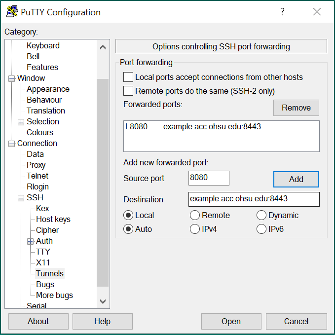

ACC - Advanced Computing Center : Windows SSH Tunneling
=======================================================

SSH clients can create a point-to-point connection between a network service and a workstation. This process is called tunneling. Tunneling is useful for creating an indirect connection when a direct connection is not possible (typically due to firewalls). In ACC environments, tunneling is often used to allow secure access to services which are not available from the main OHSU network or the internet. A common example is to allow connection to a network service running as a job in Exacloud.

There are a number of different SSH clients available for Windows.

### OpenSSH

Recent versions of Windows include [the OpenSSH client](https://learn.microsoft.com/en-us/windows-server/administration/openssh/openssh_install_firstuse?tabs=gui). This is the same SSH client that runs on macOS and Linux, so the same commands for tunneling which can be executed on those platforms also work for OpenSSH on Windows.

To create a point-to-point tunnel:

1.  Open PowerShell
2.  Connect to a server and establish a tunnel, e.g. connecting the local port 8080 to the port 8443 on a server which is only accessible within ACC:\
    `> ssh -N -L 8080:example.acc.ohsu.edu:8443 <username@acc.ohsu.edu>`
3.  Point your browser (or other application, as appropriate) to localhost:8080 to connect
4.  When done, close the SSH connection by typing **Ctrl-C** in the PowerShell window.

### Putty

[Putty ](https://www.chiark.greenend.org.uk/~sgtatham/putty/)is a popular SSH client on Windows. It allows for the configuring of SSH tunnels through options in the graphical user interface:

1.  Open Putty
2.  Configure the connection hostname and any other desired options as usual
3.  In the left pane, navigate to **Connection → SSH → Tunnels**
4.  In the **Source port** field, enter the local port you will use for connecting, e.g. `8080`
5.  In the **Destination **field, enter the server name (or IP address), followed by a colon and the destination port, e.g. `example.acc.ohsu.edu:8443`
6.  Click the **Add **button
7.  (Optional) If you'll repeat this connection, go back to the **Session **node in the left pane, and name and save the session
8.  Click **Open **to start the connection
9.  Point your browser (or other application, as appropriate) to `localhost:8080` to connect
10. When done, close the Putty window.

{ align=right }